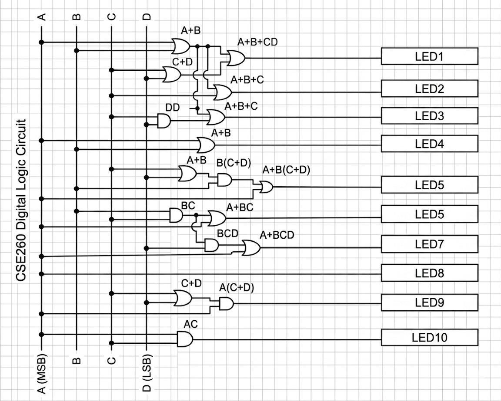
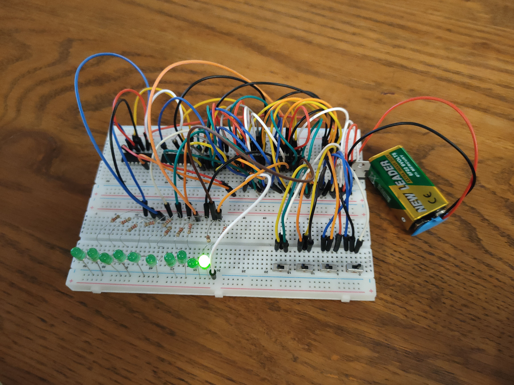
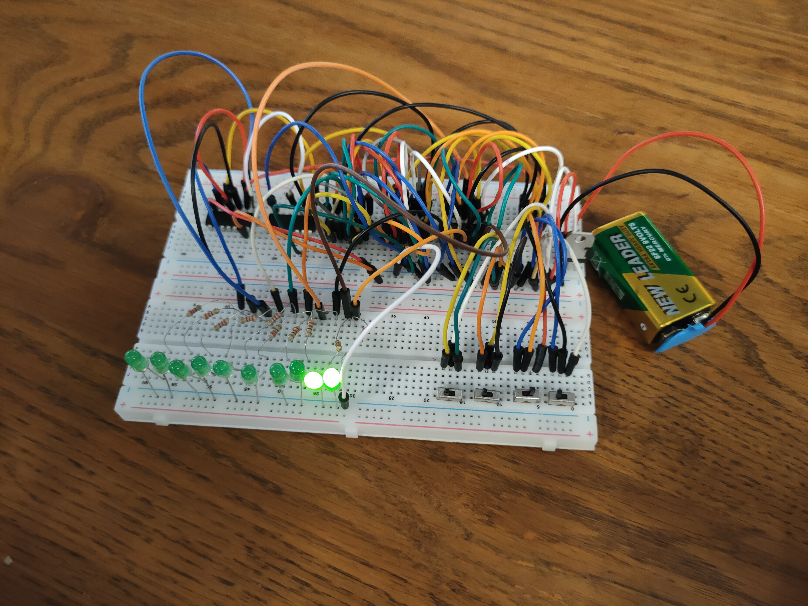
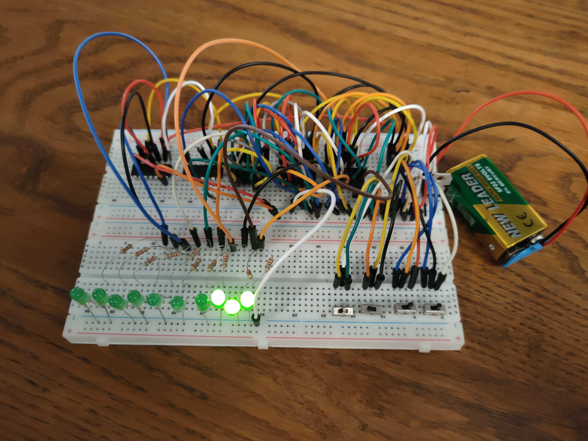
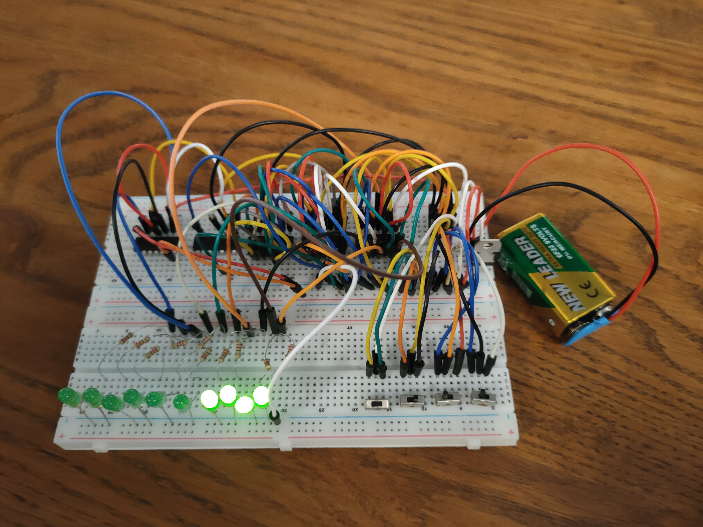
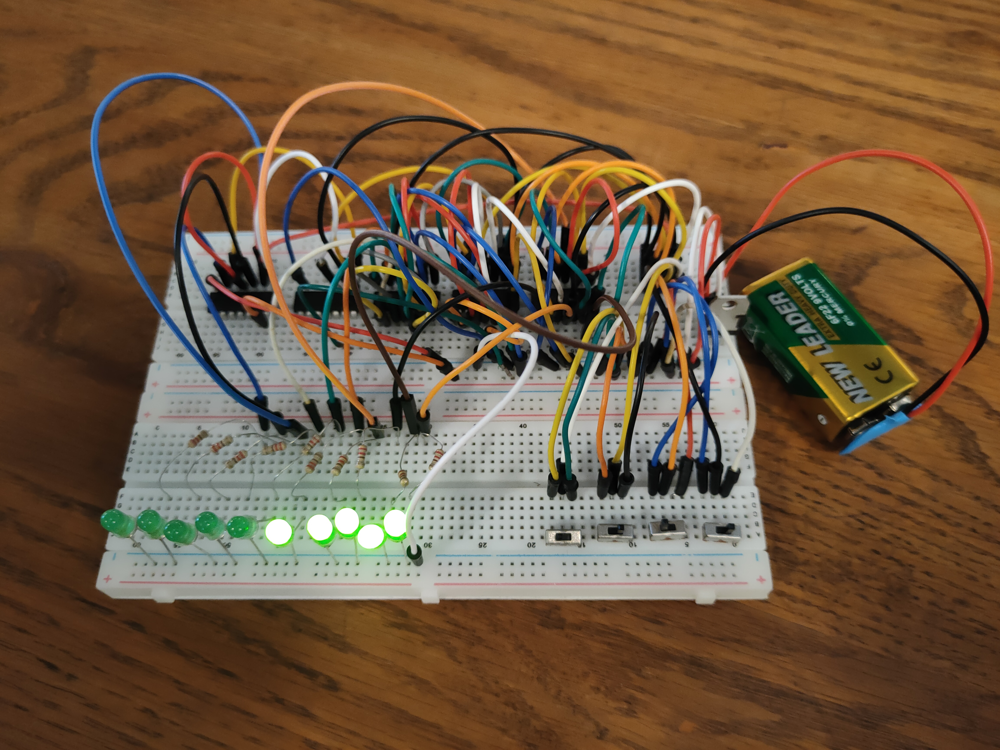
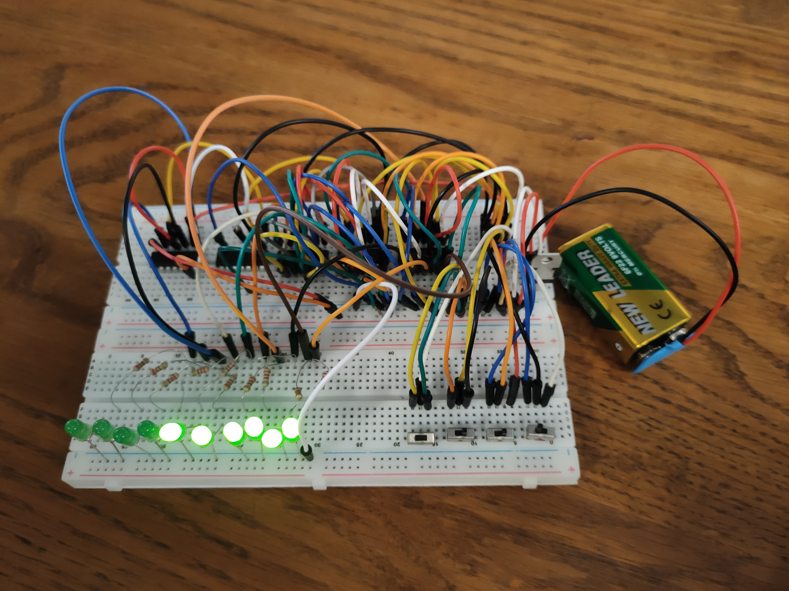
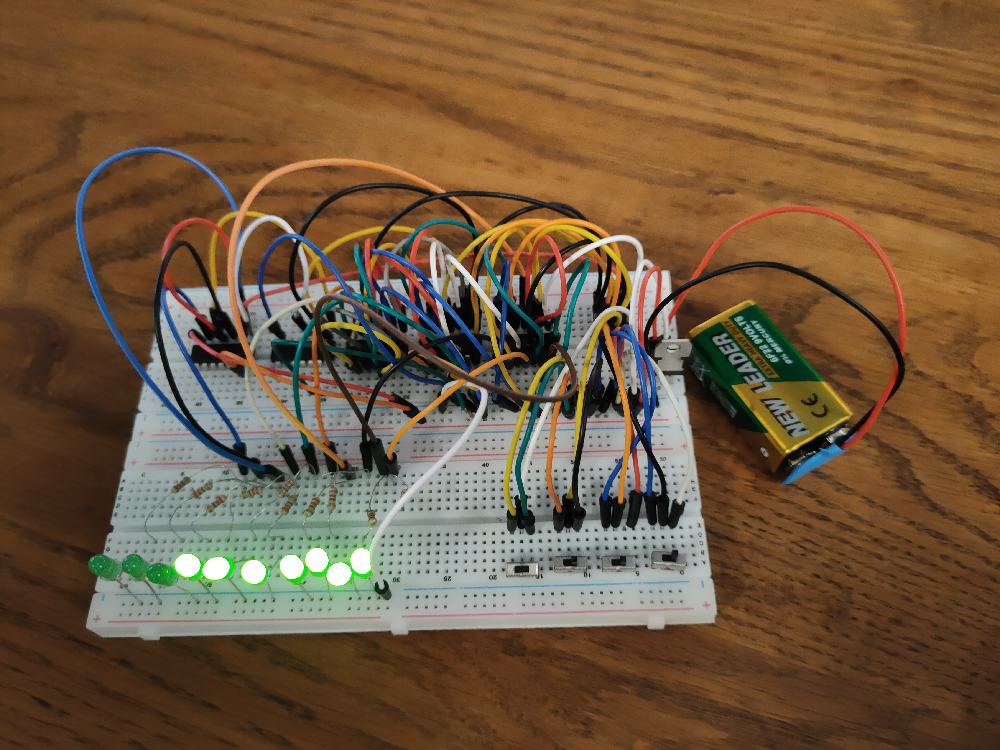
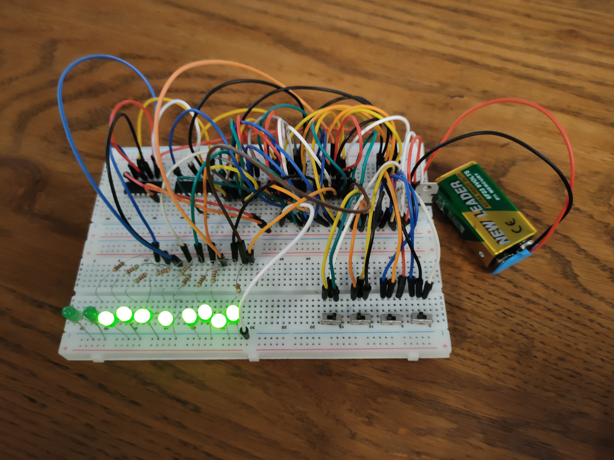

# Physical 4-Bit Binary to Decimal Hardware Converter 🔌📟
### Hardwired Combinational Logic Design, 10-Stage K-Map Optimization, and LED Matrix Display
**Course:** CSE260: Digital Logic Design | BRAC University  
**Group:** 04  

---

## 📝 Project Overview
This repository showcases a complete **physical hardware implementation** of a 4-Bit Binary to Decimal Converter built entirely on a physical prototyping breadboard ecosystem. The machine accepts a 4-bit binary input vector ($ABCD$) via manual SPDT toggle switches and decodes the combinations through discrete 74-series TTL logic integrated circuits (ICs) to dynamically drive an array of 10 sequential output LEDs.

Unlike standard software simulations, this project demonstrates hands-on engineering competencies in physical circuit layout, voltage regulation, wire-routing optimization, and hardware debugging.

---

## 📊 Logic Synthesis & K-Map Minimization
The system interprets a 4-bit binary code up to the maximum decimal state threshold of `1010` (Decimal 10). To transform these inputs into sequential counting states without a programmable microcontroller, **10 independent Karnaugh Maps (K-Maps)** were mapped out for the 4 input variables ($A, B, C, D$). 

The minimized Boolean expressions derived to drive each independent LED path are implemented as follows:

* **`LED1`** $= A + B + C + D$
* **`LED2`** $= A + B + C$
* **`LED3`** $= A + B + CD$
* **`LED4`** $= A + B$
* **`LED5`** $= A + B(C + D)$
* **`LED6`** $= A + BC$
* **`LED7`** $= A + BCD$
* **`LED8`** $= A$
* **`LED9`** $= A(C + D)$
* **`LED10`** $= AC$

---

## 🗺️ Architectural Schematic Blueprint
Before physical implementation, the Boolean functions were structured into a digitized combinational logic gateway network:

---

## 📸 Hardware State Gallery (Operational Testing)
Here is the step-by-step physical breakdown of the machine processing binary inputs across its 10 active decimal visual states:

| Decimal State | Binary Input ($ABCD$) | Active Hardware Output State |
| :---: | :---: | :---: |
| **State 1** | `0001` |  |
| **State 2** | `0010` |  |
| **State 3** | `0011` |  |
| **State 4** | `0100` |  |
| **State 5** | `0101` |  |
| **State 6** | `0110` |  |
| **State 7** | `0111` |  |
| **State 8** | `1000` |  |
| **State 9** | `1001` |  |
| **State 10** | `1010` |  |

---

## 🧱 Hardware Bill of Materials (BOM)
* **Prototyping Framework:** Premium multi-rail breadboard infrastructure
* **Logic Gates Array:** * **IC 7408** (Quad 2-Input AND Gates)
  * **IC 7432** (Quad 2-Input OR Gates)
* **Power Management Unit:** 9V Heavy-Duty Battery $\rightarrow$ Battery Connector $\rightarrow$ **IC 7805 Voltage Regulator** (Steps down 9V to a stable 5V TTL VCC/GND rail)
* **Input Interfaces:** SPDT (Single Pole Double Throw) manual toggles representing bits $A, B, C, D$
* **Passive Safety Matrix:** 10 Independent Light Emitting Diodes (LEDs) paired with **220-ohm current-limiting protection resistors**
* **Interconnects:** Solid-core low-resistance jumper wires